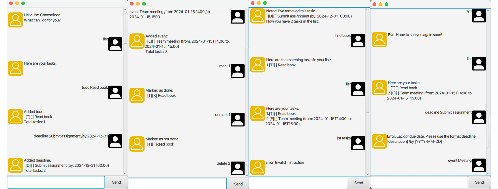

# Cheesefood User Guide


Cheesefood is a simple task management chatbot that helps you keep track of your todos, deadlines, and events.

## Adding todos

Add a simple todo task without any date/time.

Example: `todo Read book`

```
 Added todo:
   [T][ ] Read book
 Total tasks: 1
```

## Adding deadlines

Add a task with a specific due date. Supports formats: 2024-1-1, 2024-01-01, 2024-01-01 2359, 2024/1/1 23:59

Example: `deadline Submit assignment /by 2023-12-31`

```
 Added deadline:
   [D][ ] Submit assignment (by: 2023-12-31 0000)
 Total tasks: 2
```

## Adding events

Add an event with start and end times. Supports the same date formats as deadlines.

Example: `event Team meeting /from 2023-10-15 1400 /to 2023-10-15 1600`

```
 Added event:
   [E][ ] Team meeting (from: 2023-10-15 1400 to: 2023-10-15 1600)
 Total tasks: 3
```

## Listing tasks

View all your current tasks.

Example: `list`

```
 Here are your tasks:
 1.[T][ ] Read book
 2.[D][ ] Submit assignment (by: 2023-12-31 0000)
 3.[E][ ] Team meeting (from: 2023-10-15 1400 to: 2023-10-15 1600)
```

## Marking tasks as done

Mark a task as completed by its number.

Example: `mark 1`

```
 Marked as done:
   [T][X] Read book
```

## Unmarking tasks

Mark a completed task as not done.

Example: `unmark 1`

```
 Marked as not done:
   [T][ ] Read book
```

## Deleting tasks

Remove a task from your list.

Example: `delete 1`

```
 Noted. I've removed this task:
   [T][ ] Read book
 Now you have 2 tasks in the list.
```

## Finding tasks

Search for tasks containing specific keywords.

Example: `find meeting`

```
 Here are the matching tasks in your list:
 1.[E][ ] Team meeting (from: 2023-10-15 1400 to: 2023-10-15 1600)
```

## Exiting the program

End the chatbot session.

Example: `bye`

```
 Goodbye! Hope to see you again soon!
```